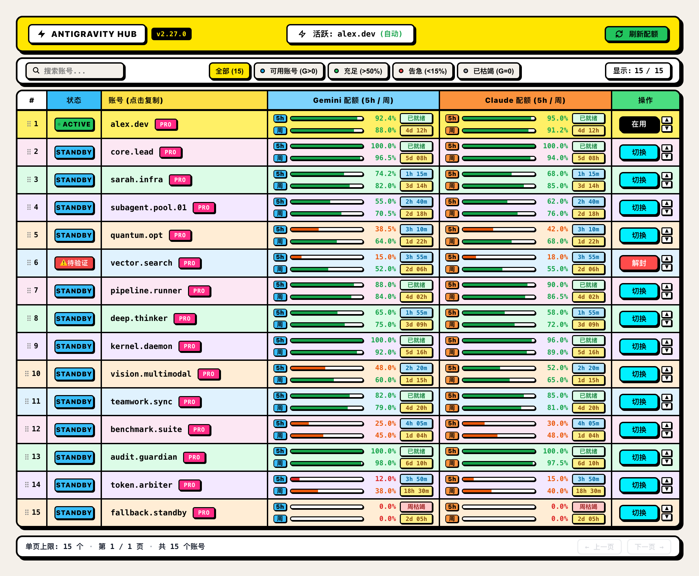
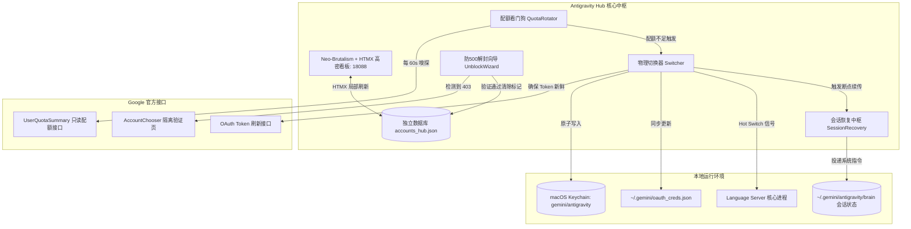

# Antigravity Hub

<p align="center">
  <strong>专为 Google Antigravity 打造的多账号高密管控看板、5小时配额自动看门狗轮转与零风控断点接力中枢</strong>
</p>

<p align="center">
  
  
  
  
  
</p>

<p align="center">
  
</p>

<p align="center">
  <em>图：Antigravity Hub 生产级实际 UI 界面（基于新野兽派 Neo-Brutalism 设计规范，呈现 15 账号并发纳管、双模型 5h/周度双轨配额条、精确恢复倒计时、实时状态标签、一键隔离解封与安全锁定）</em>
</p>

---

## 📖 诞生背景与核心痛点

在基于 Google Antigravity 进行长程编码、重构攻坚或无人值守 Teamwork 多智能体协作时，开发者往往面临以下严峻挑战：

1. **配额短板断崖与任务中断**：单账号在重度任务（如 Teamwork、长程代码扫描）中，5 小时配额会在短时间内耗尽，导致长程任务瞬间中断失败；
2. **按键模拟乱码与 Teamwork 链路掉线**：传统脚本依赖 AppleScript 模拟键盘敲击（keystroke），在中文输入法下频繁输入拼音乱码，且粗暴切号容易直接丢失未完结的 Subagents 状态；
3. **伪造调用诱发账号风控与 500 串号报错**：外部脚本如果高频发送合成伪造的 `generateContent` 预热调用，极易触发 Google 官方 `VALIDATION_REQUIRED` 账号拦截；而直接打开解封页面时，由于浏览器内登录了多个 Google 账号，Cookie 错位导致 Google 抛出 500 内部服务错误；
4. **外部配置并发写入破坏**：多进程同时读写账号文件，导致序列化冲突或凭据丢失。

**Antigravity Hub** 由此应运而生——采用纯标准库构建，融合**原生钥匙串注入**、**零 UI 侵入断点接力**、**双窗口配额看门狗**、**防 500 隔离解封向导**与 **Neo-Brutalism + HTMX 极简高密控制台**，为多账号协同与无人值守开发提供坚实护航。

---

## ⚡ 六大核心技术特性

### 1. 原生级 macOS Keychain 物理注入与【原生热切号】(Hot Switch)
- **零 UI 侵入注入**：直接调用系统底层 `security add-generic-password`，以原子级文件锁写入 macOS Keychain 钥匙串中的 `gemini/antigravity`；
- **原生平滑热切号**：针对 IDE 架构设计，切号时仅平滑重启 `language_server` 子进程，主窗口、编辑器标签页、终端与前台输入焦点 100% 保持存活，language_server 重启后 1-2 秒内自动加载新凭据，彻底告别笨重的整机或整应用重启。

### 2. 双窗口配额看门狗与【全局禁止自动轮换总闸】(Quota Watchdog & Manual Lock)
- **双窗口实时守护**：高频并发监控 5 小时滑动桶与周度配额，实施短板防御；
- **【全局禁止自动轮换总闸】**：控制台顶栏实装全局自动轮换开关（开绿关红）。当需要专心使用 Claude 或固定指定账号时，一键物理阻断后台看门狗切号；切换回开启态后立即自动以 Gemini 为主力进行耗尽自动接力；
- **级联瀑布选号**：在自动轮换开启态，当当前账号配额低于阈值（默认 5%）时，自动过滤不可用或风控账号，按优先级权重与剩余健康配额综合打分，平滑无感切号；
- **人工切换场景脱耦**：用户在控制台手动点击切换账号时，仅执行凭据热更新与语言服务器原地重载，显式传入 `inject_recovery=False`，绝不向任何会话乱发接力词。

### 3. 零 UI 侵入断点接力与【Teamwork 专属恢复引擎】(Zero-UI Relay & Teamwork Engine)
- **彻底拔除按键模拟**：100% 摒弃 AppleScript 物理按键，杜绝拼音乱码；
- **【已完结任务物理跳过门禁 (Finished Task Filter)】**：穿透系统打点逆序分析会话主体事件。若最后事件为已交付最终答复的 `PLANNER_RESPONSE` 且无在途活跃子代理，直接物理跳过不投递，彻底杜绝“任务已完成每次轮换还要被唤醒”的体验痛点；
- **【Teamwork 多智能体专属断点恢复提示词引擎】**：动态识别多智能体任务，精确提取会话下属各 Subagents 角色，自动组装强化版指令，明确要求“立即检查各子代理任务进度与存活状态，无缝恢复团队协同管线推进，严禁丢弃未完工协同分支”，确保无人值守推进至终态交付。

### 4. 智能防 500 定向解封向导 (Smart AccountChooser & Isolated Wizard)
- **临期 Token 自动刷新**：检查前自动续签过期 OAuth Token，彻底消除因 401 引起的假死误判；
- **AccountChooser 智能定向路由**：将官方 `validation_url` 动态封装为 Google AccountChooser 定向链接，精准携带目标账号身份参数，彻底杜绝多账号登录 Cookie 错位导致的 500 报错；
- **独立 Profile 隔离沙盒**：一键拉起独立 Chrome / Brave 容器（`--user-data-dir`），会话互不污染；
- **后台常驻秒级自愈监听 (`--watch`)**：每 5 秒自动嗅探 Google 辅助接口，用户在网页端通过验证后，毫秒级自动清除本地与 Hub 风控标记，全自动重返可用池。

### 5. Neo-Brutalism + HTMX 极简高密控制台 (High-Density Dashboard)
- **新野兽派视觉规范**：采用无模糊硬阴影 (`4px 4px 0px #000`)、粗实线黑描边 (`2.5px solid #000`)、纸张底色 (`#F4F0EA`) 与 5 组高对比度 Pastel 色盘；
- **HTMX 声明式局部刷新**：毫秒级局部渲染，杜绝整页刷新带来的滑块回弹与白屏抖动；
- **全状态透视**：支持 10+ 至上百账号高密呈现、拖拽排序 (Drag & Drop)、一键手动切号、一键隔离解封与剩余时间动态计算。

### 6. 零风控只读隔离架构 (Zero-Risk Read-Only Design)
- **严格只读单向同步**：读取外部凭据时仅执行只读分析，绝不向第三方客户端关键目录回写一字节，杜绝反序列化冲突；
- **物理切断伪造调用**：全面切断所有自动伪造的 `generateContent` 脚本调用，仅通过官方配额只读摘要接口探针探测，从源头杜绝触发 Google 风控。

---

## 🏛️ 系统架构拓扑



---

## 🚀 极速上手

### 环境要求
- **操作系统**：macOS (推荐，支持钥匙串原生热切号) 或 Linux
- **Python 版本**：Python 3.9 及以上
- **依赖**：**零强制第三方依赖**（基于 Python 原生标准库实现）

### 1. 克隆仓库
```bash
git clone https://github.com/dunova/antigravity-hub.git
cd antigravity-hub
```

### 2. 准备配置 (可选)
如果是首次使用且已有凭据，Hub 启动时会自动尝试从本地只读导入已登录账号。你也可以通过配置文件或环境变量提供基础凭据：
```bash
cp config.example.json config.json
```

支持的环境变量：
```bash
export GOOGLE_CLIENT_ID="YOUR_CLIENT_ID.apps.googleusercontent.com"
export GOOGLE_CLIENT_SECRET="YOUR_CLIENT_SECRET"
export ANTIGRAVITY_HUB_DIR="$HOME/.antigravity_hub"
```

### 3. 一键启动 Hub
```bash
python3 start_hub.py --open-browser
```
启动后即可在浏览器访问：`http://127.0.0.1:18088`

---

## 📥 多账号纳管、导入导出与彻底独立运维指南

Antigravity Hub 具备 **100% 原生独立的账号纳管引擎**，彻底脱离对任何外部第三方工具（如 `Antigravity Tools` 等）的依赖。新用户无论是仅有 1 个账号还是拥有数十个账号，均可通过以下极简途径完成纳管与备份：

### 途径一：Google OAuth 浏览器一键授权自动取 Token (首选推荐)
全程无需知道或手填任何 Token，与官方客户端同源 Loopback 授权流：
1. 点击看板顶栏右侧的 **`📥 导入`** 按钮（默认打开 **`🌐 Google 授权添加新账号`**）；
2. 点击 **`🌐 弹出浏览器登录 Google 授权`**（或 **`🛡️ 拉起独立 Chrome 容器授权`** 防多号串号）；
3. 在弹出的 Google 官方登录页选择账号并点击「允许」；
4. 本地 `127.0.0.1:18088/oauth-callback` 自动捕获回调 `code`，后台全自动换取 `refresh_token`、读取邮箱、入库并并发拉取最新双模型配额！

### 途径二：IDE 钥匙串一键吸纳 (Sync Active)
1. 点击 **`📥 导入`** -> **`⚡ 从当前 IDE 一键吸纳`**；
2. 点击 **`⚡ 立即从 IDE 钥匙串检测并吸纳新账号`**，自动提取当前 macOS Keychain 中已登录的 Antigravity IDE 账号凭据并入库。

### 途径三：批量导入与一键导出 JSON 备份 (Import / Export JSON)
- **批量导入**：切换到 **`📁 批量导入 JSON 备份`** 选项卡，上传 `.json` 备份文件或直接粘贴 JSON 文本，支持 Hub 标准备份包、对象数组或字典映射，自动去重合并；
- **一键导出**：点击看板顶栏右侧的 **`📤 导出`** 按钮，立即生成并下载 `antigravity_accounts_backup.json` 全量备份文件。

### 途径四：命令行 (CLI) 自动化运维
对于脚本编写与自动化集成场景，支持直接通过命令行执行导入导出与吸纳：
```bash
# 1. 立即从当前 IDE/系统安全钥匙串吸纳新登录账号并退出
python3 start_hub.py --sync-active

# 2. 导出全量账号备份到指定文件并退出
python3 start_hub.py --export /path/to/my_accounts_backup.json

# 3. 从指定 JSON 文件批量导入/合并账号并退出
python3 start_hub.py --import /path/to/my_accounts_backup.json
```

---

## 🛠️ 命令行运维工具指南

### 1. 启动选项
```bash
# 指定自定义端口启动
python3 start_hub.py --port 19000

# 纯后台服务模式（不自动弹出浏览器）
python3 start_hub.py --port 18088

# 仅启动 Web 看板，不运行后台自动换号看门狗
python3 start_hub.py --no-rotator
```

### 2. 账号解封向导 CLI (`cli/unblock_wizard.py`)
当账号因 IP 频繁切换等外部因素遭遇 Google 网页验证拦截时，使用解封向导：

```bash
# 1. 扫描当前所有处于拦截态的账号与智能防 500 链接
python3 cli/unblock_wizard.py --list

# 2. 为指定账号拉起专属独立 Chrome 隔离 Profile 窗口进行验证
python3 cli/unblock_wizard.py --open user@example.com

# 3. 启动后台 5 秒常驻自愈监听守护进程（网页点击通过后自动毫秒级解锁并入池）
python3 cli/unblock_wizard.py --watch
```

---

## 📂 项目工程结构

```
antigravity-hub/
├── README.md                 # 架构级技术文档与上手指南
├── LICENSE                   # MIT 开源协议
├── requirements.txt          # 极简依赖规范 (纯标准库)
├── config.example.json       # 样例脱敏配置文件
├── start_hub.py              # 一键集成启动入口
├── core/                     # 核心引擎包
│   ├── __init__.py
│   ├── switcher.py           # 物理钥匙串注入、凭据同步与热切号引擎
│   ├── rotator.py            # 5 小时配额看门狗与瀑布级联轮转守护进程
│   └── recovery.py           # 会话精准嗅探与零 UI 侵入断点接力管理器
├── hub/                      # Web 控制台服务包
│   ├── __init__.py
│   ├── server.py             # Neo-Brutalism + HTMX 高密管理看板服务器
│   └── importer.py           # 纯只读零副作用外部账号导入工具
└── cli/                      # 命令行辅助工具包
    ├── __init__.py
    └── unblock_wizard.py     # 智能防 500 定向隔离解封向导与自动监听中枢
```

---

## 🛡️ 安全与隐私声明 (Privacy & Security)

1. **100% 本地运行**：所有 OAuth Token、账号配置、配额缓存与运行日志均保存在本地目录（默认 `~/.antigravity_hub/`），绝对不向任何第三方云端或外部服务器回传；
2. **零凭据硬编码**：核心代码库完全消除个人凭据、私人邮箱与绝对路径，所有 OAuth 凭据均通过环境变量或本地配置文件管理；
3. **安全隔离访问**：Web 看板默认且强制仅绑定本地回环地址 `127.0.0.1`，杜绝公网暴露风险。

---

## 📜 版本更新日志 (Changelog)

### v2.37.3 (2026-10-05)
- **「在用」按钮行内样式防缓存保真**：针对 HTMX 局部替换 `<tbody>` 不刷新 `<head>` 的特性，将 Neo-Brutalism 薄荷绿 (`#4ADE80`)、粗实线黑描边与加粗黑字写死为行内 `style` 属性，彻底免疫浏览器 CSS 缓存；
- **拔除 3D 拟物 Emoji 纯化**：彻底移除 macOS 原生带高光球的 `🟢` Emoji，纯化为粗黑无衬线「在用」标识，全表操作列 100% 保持 128px 像素级双钮绝对居中对称；
- **Gemini + Claude 双模全息并发预热引擎**：重构预热激活流水线，根据账号 Claude 权限精准分流（Claude 5.5 付费 Pro 发送 `claude-sonnet-5-5-low`，普通 Pro 发送 `claude-sonnet-4-6`），双轨 5 小时滚动重置倒计时同步激活并回写；
- **Claude 5.5 与 4.6 区分度紧凑徽章**：重构账号列 30px 超紧凑固定宽度标签（琥珀金 5.5 vs 经典粉 4.6），彻底根除首字母挤压截断问题；
- **现役 ego lite 浏览器原生解封与 OAuth 适配**：解封向导优先探测系统现役 ego lite 浏览器，消除旧版写死 Chrome 导致的拉起静默失败。

### v2.35.0 (2026-10-04)
- **零账号冲刷物理阻断门禁与本地 APFS 双写容灾**：网络挂载脱机时自动从本地恢复历史备份，杜绝意外冲刷。

### v2.34.0 (2026-10-04)
- **已完结会话物理拦截跳过门禁 (Finished Task Filter)**：穿透系统打点逆序分析会话主体事件，若最后事件为已交付最终文本的 `PLANNER_RESPONSE` 且无在途子代理，物理跳过不投递，彻底解决“任务已完成每次轮换还要被唤醒”的痛点；
- **Teamwork 多智能体专属断点恢复提示词引擎**：自动识别多智能体任务，精确提取下属各 Subagent 角色，注入包含“检查未完工子代理状态、恢复协同管线、严禁丢弃协同分支”的强化指令；
- **全局禁止自动轮换总闸与双模解耦**：顶栏实装全局自动轮换开关，在 Claude 专享与 Gemini 主力模式间无缝切换，手动切号传参 `inject_recovery=False`，彻底脱耦人工换号与自动接力；
- **多机集群版本自动化同步规范**：确立新版本发布 4 步铁律（更新版本号、本机更新、推送到 01 M4 机器、更新 GitHub Readme）。

### v2.33.0 (2026-10-04)
- **全局自动轮换开关与双模健康防误切守卫**：实装轮换状态持久化与毫秒级 OOB 状态刷新，优化双模配额判定。

### v2.32.0 (2026-10-03)
- **官方 Protobuf 错峰预热流水线**：单账号微型错峰生成预热，消除风控假死。

---

## 📄 开源许可证

本项目基于 [MIT License](LICENSE) 开源发布。
欢迎提交 Issue 与 Pull Request 共同改进！

